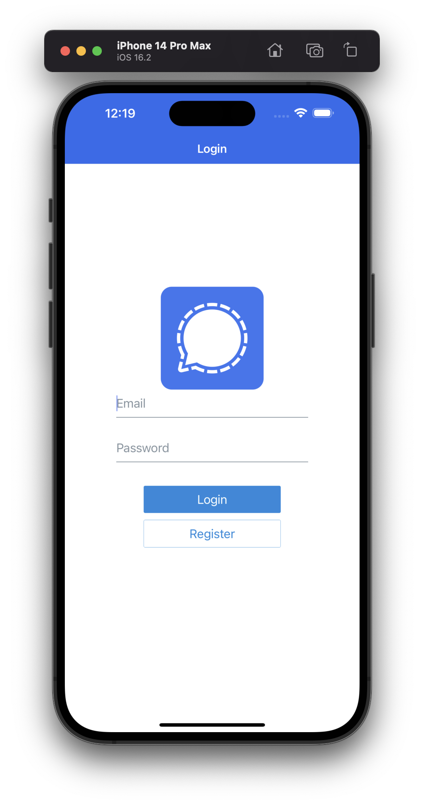

# Signal with `React-Native` + `Firebase` 📨

### Technologies ✨

- `React-Native`
- `Expo`
- `Nativebase`
- `@react-navigation`
- `Firebase` authentication & `firestore` persistent with `async-storage`

### Screenshots & video 🌃

https://github.com/ng-ha/signal/assets/115610452/adb29916-2e10-4edf-a89f-9909c565b8e7

### License :right_anger_bubble:

[MIT](https://choosealicense.com/licenses/mit/)
